# 임베디드 통신시스템 프로젝트 - 가상 제스처 보드

이 프로젝트는 **ml5.js**와 **p5.js**를 활용해 웹캠으로 손동작을 인식하고, 이를 통해 **반응형 버튼**, **간편한 제스처 모드 전환**, 그리고 **그림/글을 그릴 수 있는 팔레트**를 구현합합니다. 화상 미팅이나 실습 환경에서 직관적이고 빠른 시각적 피드백을 제공하기 위해 기획되었습니다.

---

## 시연영상
아래 영상을 통해 **제스처 인식 모드**, **반응형 버튼**, **팔레트 모드(펜·지우개·색상·사이즈·전체 지우기)** 등의 기능을 확인할 수 있습니다. 또한 **OBS 가상 카메라**를 사용해 Zoom 환경에서 실시간 반응형 리액션을 시연합니다.

[](https://youtu.be/Hr03iZf8Jxg)

---

## 개요
본 프로젝트의 주요 목표는 다음과 같습니다:
- **손동작(제스처) 인식**: ml5.js HandPose 모델로 엄지·검지 등 손가락 관절을 추적해, 특정 모양(ThumbsUp, Emergency 등)을 인식하고 상태를 전환.
- **반응형 버튼**: 화면에 배치된 4개 버튼(인사, 감동, 웃음, 놀람 등)을 검지 손가락으로 1초간 누르면 3초간 특정 이모지 반응을 실행.
- **팔레트 모드**: 손가락을 모두 펼쳐 진입하며, 펜/지우개/색상/사이즈/전체 지우기 기능을 지원. 손가락으로 직접 그림을 그리거나 지울 수 있음.
- **OBS 가상 카메라 연동**: 실제 웹캠 대신 프로젝트 화면을 카메라 소스로 송출해, Zoom 같은 화상 회의에서 직관적인 인터랙션을 제공.

---

## 유스 케이스 다이어그램
아래 다이어그램은 **4가지 제스처 모드**와 **4개의 반응형 버튼**, 그리고 **팔레트 모드**의 사용 흐름을 간단히 나타냅니다.

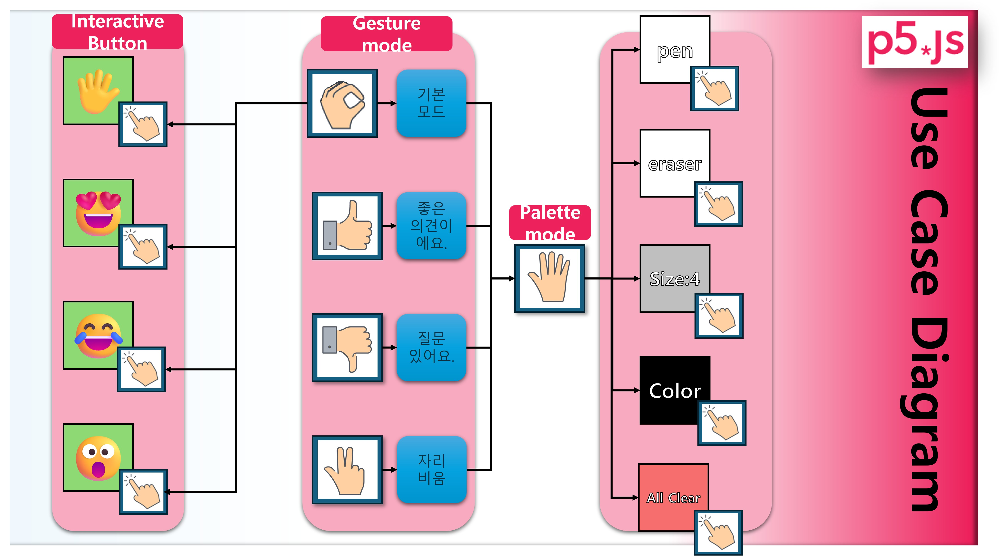
> **제스처 모드**: 엄지 위(ThumbsUp), 엄지 아래(ThumbsDown), 긴급(Emergency), 기본(Default) 등  
> **반응형 버튼**: 인사, 감동, 웃음, 놀람  
> **팔레트 모드**: 펜/지우개 선택, 펜·지우개 사이즈 조절, 색상 선택, 전체 지우기 등  

이를 통해 사용자는 **손 제스처**와 **화면 상의 버튼**을 자유롭게 활용하여, 화상 미팅이나 시연 상황에서 **빠르고 풍부한 시각 피드백**을 제공할 수 있습니다.

---
## 반응형 제스처 동작 및 설명

|             | **Default**                                                                                  | **Emergency**                                                                                         | **ThumbsUp**                                                                                       | **ThumbsDown**                                                                                      | **Palette**                                                                                           |
|:-----------:|:--------------------------------------------------------------------------------------------:|:------------------------------------------------------------------------------------------------------:|:---------------------------------------------------------------------------------------------------:|:----------------------------------------------------------------------------------------------------:|:----------------------------------------------------------------------------------------------------:|
| **패턴이미지** | <div align="center">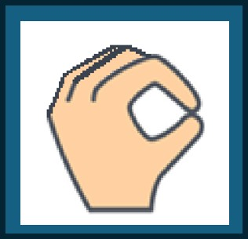</div>                 | <div align="center">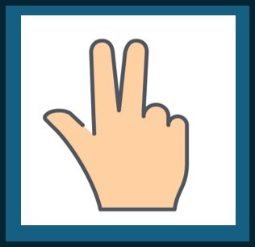</div>                        | <div align="center">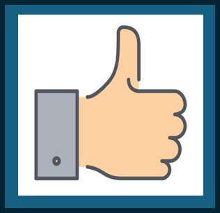</div>                      | <div align="center">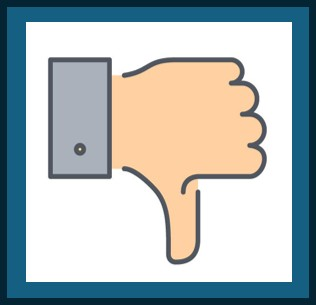</div>                     | <div align="center">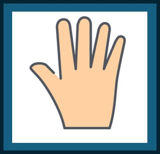</div>                         |
| **설명**      | 손가락을 모두 모아 기본 상태를 유지합니다. 이때 반응형 버튼(인사·감동·웃음·놀람)을 사용할 수 있습니다. | 엄지·검지·중지를 펴고 약지·새끼를 접어 긴급(자리 비움)을 빠르게 전달합니다. 화면 전체가 반투명 검은색 처리되어 "자리 비움" 메시지를 표시합니다. | 엄지만 위로 들어 공감·동의를 표현합니다. 반투명 초록색 배경 위에 "좋은 의견이에요!"가 나타납니다.  | 엄지를 아래로 내려 궁금증·반대 의견을 표현합니다. 반투명 오렌지색 배경에 "질문 있어요!"가 표시됩니다. | 다섯 손가락을 펼쳐 팔레트 모드로 진입합니다. 펜·지우개·색상·크기 선택 등 그림 UI가 활성화됩니다. |

> **제스처 모드 추가 정보**  
> - `Default` 상태에서만 반응형 버튼(인사·감동·웃음·놀람)이 작동합니다.  
> - `Palette` 모드로 들어가면 다른 제스처 모드가 일시적으로 비활성화됩니다.  
> - 긴급/기본 모드(`Emergency`/`Default`) 또는 엄지 동작(`ThumbsUp`/`ThumbsDown`)은 1초간 제스처를 유지해야 확정됩니다.
---

## 반응형 버튼 동작 및 설명

|              | **인사 (🖐️)**                                                                                         | **감동 (😍)**                                                                                           | **웃음 (🤣)**                                                                                          | **놀람 (😮)**                                                                                          |
|:------------:|:------------------------------------------------------------------------------------------------------:|:--------------------------------------------------------------------------------------------------------:|:-------------------------------------------------------------------------------------------------------:|:-------------------------------------------------------------------------------------------------------:|
| **패턴이미지** | <div align="center">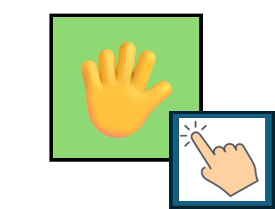</div>                  | <div align="center">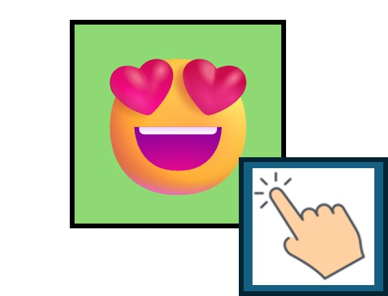</div>                    | <div align="center">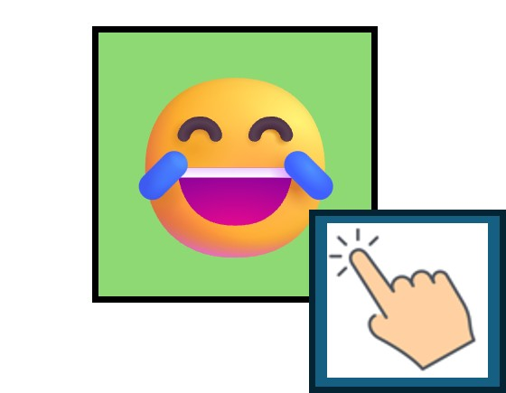</div>                   | <div align="center">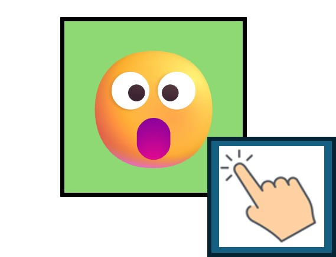</div>               |
| **설명**      | 1초간 버튼 위에 검지를 올려두면 활성화됩니다. 3초 동안 “안녕하세요! 반가워요.” 메시지와 함께 손 흔드는 이모지가 화면 양옆에 나타납니다. | 1초간 버튼 위에 검지를 올려두면 활성화됩니다. 3초 동안 “감동 받았어요!” 메시지와 함께 하트 이모지가 화면 곳곳에 떠다니며 감동적인 분위기를 연출합니다. | 1초간 버튼 위에 검지를 올려두면 활성화됩니다. 3초 동안 “웃음이 터져요!” 메시지와 함께 웃음 이모지가 아래에서 위로 떠올라 유쾌한 분위기를 전달합니다. | 1초간 버튼 위에 검지를 올려두면 활성화됩니다. 3초 동안 “놀라워요!” 메시지와 함께 놀란 이모지가 중앙에서 사방으로 퍼져 놀라움을 시각적으로 표현합니다. |

> **버튼 활성화 로직**  
> - 각 버튼은 **연한 녹색** 상태로 시작하며, 1초간 검지가 버튼 위에 머무르면 **주황색 게이지**가 차오릅니다.  
> - 게이지가 가득 차면 해당 이모지 효과가 **3초** 동안 재생됩니다.  
> - 활성화된 동안 다른 버튼은 **연한 적색**으로 비활성화됩니다.  
> - 3초 후 효과가 종료되면 다시 연한 녹색으로 돌아가 **선택 가능** 상태가 됩니다.

---

## 팔레트 UI 제스처 및 버튼 동작

|              | **All Clear**                                                               | **펜 (pen)**                                                               | **지우개 (eraser)**                                                           | **색상 패드**                                                                 | **펜/지우개 사이즈**                                                           |
|:------------:|:----------------------------------------------------------------------------:|:---------------------------------------------------------------------------:|:------------------------------------------------------------------------------:|:------------------------------------------------------------------------------:|:------------------------------------------------------------------------------:|
| **이미지**   | <div align="center">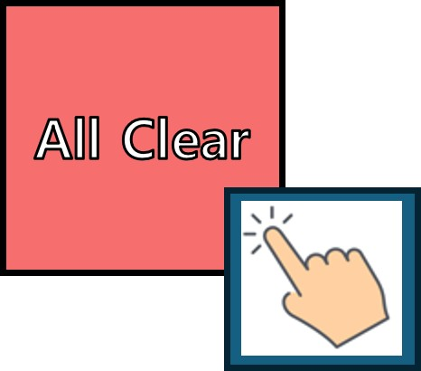</div> | <div align="center">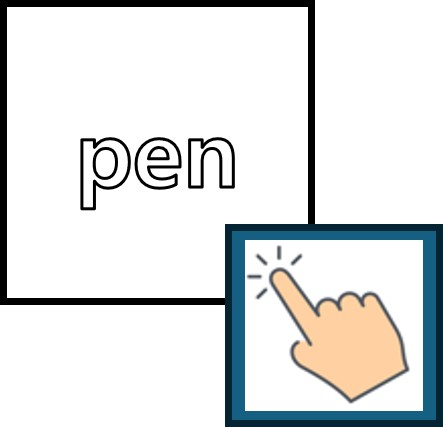</div>    | <div align="center">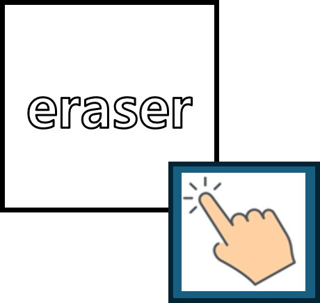</div>    | <div align="center">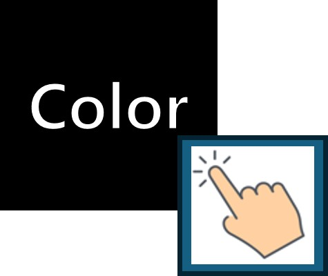</div>    | <div align="center">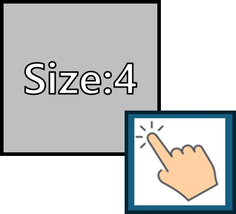</div>     |
| **설명**     | “All Clear” 버튼을 1초간 누르면 그려진 모든 내용을 지울 수 있습니다. 검지 손가락이 버튼 위에 있을 때 주황색 게이지가 차오르면 `drawingLayer`가 clear됩니다. | “pen” 아이콘을 1초간 누르면 펜 모드가 활성화됩니다. 엄지·검지를 핀치하면 보라색 원이 표시되고, 보라색 원은 실제 펜촉의 3배의 크기로 시각화 됩니다. 그 경로를 따라 `drawingLayer`에 선이 그려집니다. | “eraser” 아이콘을 1초간 누르면 지우개 모드가 활성화됩니다. 엄지·검지를 핀치하면 보라색 원 범위만큼 `drawingLayer`가 지워집니다. | “Color” 블록을 1초간 누르면 4×4 색상 패널이 펼쳐집니다. 해당 색상 셀 위에 검지를 1초 유지하면 펜 색상이 바뀝니다. | “Size : n” 블록을 1초간 누르면 2×8(16칸)의 사이즈 패널이 펼쳐집니다. 셀을 1초 유지하면 펜·지우개 크기가 1~16 픽셀로 변경됩니다. |

> **팔레트 모드 (제스처 "Palette")**
> - 다섯 손가락을 모두 펼쳐 인식되면 팔레트 모드가 활성화됩니다.  
> - 다시 “Palette” 제스처를 취하거나, “Default” 제스처(손가락 모으기)로 복귀하면 해제됩니다.  
> - 팔레트 모드 동안에는 다른 제스처 모드나 반응형 버튼이 잠시 비활성화됩니다.

---

## OBS 설정 및 Zoom 연동

이 프로젝트에서 구현된 인터랙티브 화면을 실제 화상 미팅(예: Zoom)에서 활용하기 위해서는 **OBS**(Open Broadcaster Software)의 **가상 카메라(Virtual Camera)** 기능을 사용할 수 있습니다. 아래는 간단한 설정 및 연동 절차입니다.

1. **OBS 설치**  
   - [OBS 공식 사이트](https://obsproject.com/)에서 운영체제에 맞는 설치 프로그램을 다운로드하고 설치합니다.
   - 설치 완료 후 OBS를 실행합니다.

2. **OBS 장면(Scene) 구성**  
   - OBS를 실행한 뒤, 하단의 **소스(Sources)** 패널에서 **+ 버튼**을 눌러 새로운 **“Window Capture”**(또는 “Display Capture”) 소스를 추가합니다.
   - 이때 **p5.js**가 동작하는 브라우저 창(또는 전체 디스플레이)을 캡처 소스로 선택합니다.
   - 필요에 따라 레이아웃을 조정하고, 오버레이 텍스트나 이미지를 추가할 수도 있습니다.

3. **가상 카메라(Virtual Camera) 활성화**  
   - OBS 하단의 **“Controls”** 섹션(기본 우측 하단)에 있는 **“Start Virtual Camera”** 버튼을 클릭합니다.
   - 만약 이 버튼이 보이지 않는다면, **OBS 버전**이 최신인지 확인하거나 **Tools > VirtualCam**(Windows 전용 플러그인) 메뉴를 사용하세요.

4. **Zoom에서 가상 카메라 선택**  
   - Zoom 클라이언트를 실행하고, **설정(Settings)** > **비디오(Video)** 탭으로 이동합니다.
   - **카메라 선택 드롭다운**에서 **“OBS Virtual Camera”**(또는 “OBS-Camera”)를 선택합니다.
   - 이제 Zoom 미팅 화면에, 실제 카메라 대신 OBS에서 송출하는 화면(즉, p5.js 인터랙티브 화면)이 표시됩니다.

5. **실시간 상호작용**  
   - p5.js에서 손동작을 통해 반응형 버튼이나 제스처 모드를 전환하면, OBS를 통해 Zoom으로 전송되는 영상도 즉시 반영됩니다.
   - Zoom 참여자들은 사용자의 **인사·감동·웃음·놀람** 버튼 효과, 혹은 **엄지손가락 제스처**, **팔레트 그림 그리기** 등을 실시간으로 볼 수 있습니다.

---

### 추가 사항
- **왼손/오른손 모두 지원**  
  - HandPose를 활용하여 양손 구분 없이 **손가락 관절 포인트**를 인식하도록 구현하였습니다. 왼손/오른손 어느 쪽을 사용해도 동일하게 동작합니다. 
  - 다만, 손가락 펼침 방향에 따라 제스처가 미세하게 달라 보일 수 있으므로, 카메라 각도에 맞춰 손을 인식하는 것이 좋습니다.

- **가깝고 먼 상황 모두에서 인식지원**
  - `handSize = dist(wrist.x, wrist.y, middleTip.x, middleTip.y)` 형태로 손목과 중지 끝 사이 거리를 측정하고, 이를 기준으로 `closeThreshold` (예: `handSize * 0.2`)를 설정하여 손가락이 모여있는지 판단합니다.  
  - 또한, `factor = 1.2`처럼 손가락 확장 여부를 결정하는 계수를 도입해, 손의 크기가 달라져도 동일한 비율 기준으로 판별하도록 설계되었습니다.  
  - 이 접근법은 카메라와 손의 실제 거리가 달라지더라도, **상대적 비율**을 사용하기 때문에 제스처 인식의 정확도가 크게 떨어지지 않습니다.  

- **쿨다운(gestureTimer) 게이지**  
  - 특정 제스처(엄지 위, 엄지 아래 등)를 **1초 이상** 유지하면 최종 확정하도록 하는 로직입니다.  
  - `gestureTimer`와 `gestureThreshold`를 사용해, 매 프레임(`draw()`)마다 제스처 유지 시간을 측정하고,  
    `drawGestureGauge(progress, avgPos)`로 **시각적 게이지**를 표시합니다.  
  - 이를 통해 **순간적인 흔들림**에 의해 잘못 모드가 전환되는 것을 방지하고,  
    사용자가 **1초 쿨다운**이 얼마나 진행됐는지 직관적으로 확인할 수 있습니다.

- **언노운(Unknown) 제스처**  
  - 정의되지 않은 동작(예: 새끼손가락, 검지손가락만 올리는 등)은 **언노운** 상태로 처리해 모드 전환에 영향을 주지 않습니다.  
  - 언노운 상태를 활용하여 동일한 모드를 반복적으로 전환하고자 할 때 [예) Default -> Default], 팔레트 모드 진입·이탈할 때, 원활한 제어를 돕습니다.

- **카메라**:  
  - 이 프로젝트는 일반 노트북 내장 카메라 대신, **Logitech Brio 500** 외장 카메라 기반으로 테스트되었습니다.  
  - 일반적으로 **다른 웹캠**이라도 브라우저에서 인식되는 장치라면 사용 가능합니다.

**상세 코드 설명**
  - `p5` 폴더 내부에는 코드전체에 대한 구조적 흐름을 포함한 README.md와 sketch.js에 변수, 함수, 동작에 대해 아주 상세하게 적어 놓았습니다.

---

## 디렉터리 구조

아래는 **ECS_INTERACTIVE_REACTIONS** 프로젝트의 전체 폴더 구성입니다.

```plaintext
ECS_INTERACTIVE_REACTIONS/
├── p5
│   ├── index.html           # 웹 UI (HTML 파일)
│   ├── README.md            # (p5 관련 설정/설명 등)
│   ├── sketch.js            # p5.js 스케치 (UI/제스처 제어 로직)
│   └── style.css            # 웹 UI 스타일 시트
│
├── image
│   ├── gesture_default.jpg         # 손동작(Default) 예시 이미지
│   ├── gesture_emergency.jpg       # 손동작(Emergency) 예시 이미지
│   ├── gesture_palette.jpg         # 손동작(Palette) 예시 이미지
│   ├── gesture_thumbsup.jpg        # 손동작(ThumbsUp) 예시 이미지
│   ├── gesture_thumbsdown.jpg      # 손동작(ThumbsDown) 예시 이미지
│   ├── Interactive_button_heart.jpg  # 반응 버튼(감동) 예시
│   ├── Interactive_button_laugh.jpg  # 반응 버튼(웃음) 예시
│   ├── Interactive_button_suprised.jpg # 반응 버튼(놀람) 예시
│   ├── Interactive_button_hand.jpg  # 반응 버튼(인사) 예시
│   ├── pallete_AllClear.jpg         # 팔레트 '전체 지우기' 버튼 예시
│   ├── pallete_color.jpg            # 팔레트 색상 패드 예시
│   ├── pallete_eraser.jpg           # 팔레트 지우개 예시
│   ├── pallete_pen.jpg              # 팔레트 펜 예시
│   └── Use_Case_Diagram.jpg         # 유스 케이스 다이어그램
│
├── LICENSE
└── README.md                # 최상위 README (프로젝트 개요/설명)
```
---

## 라이선스
이 프로젝트는 [MIT License](./LICENSE) 하에 오픈소스로 공개됩니다.

---

## 추가 참고
더 자세한 설명은 `p5`폴더 내의 README.md와 코드의 주석을 참고해주세요.  
필요한 설정, 함수별 동작 원리, 그리고 확장 아이디어가 상세히 기재되어 있습니다.